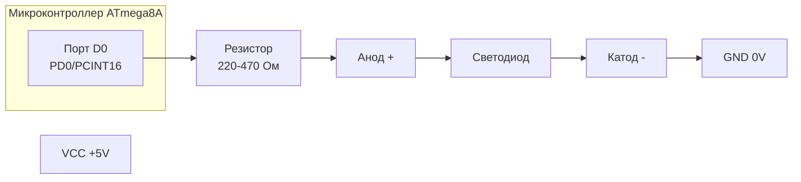
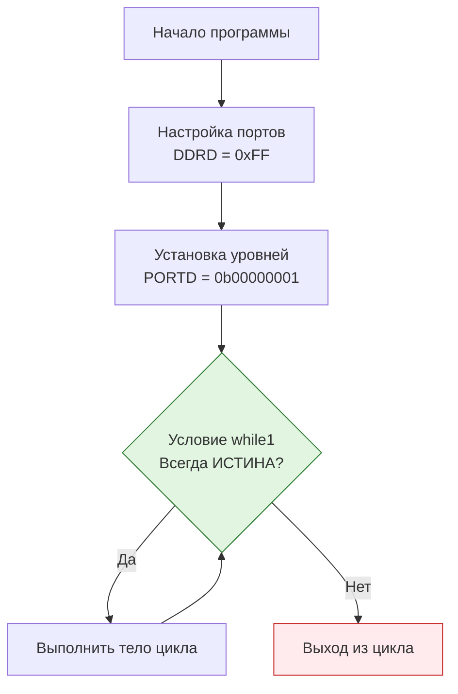
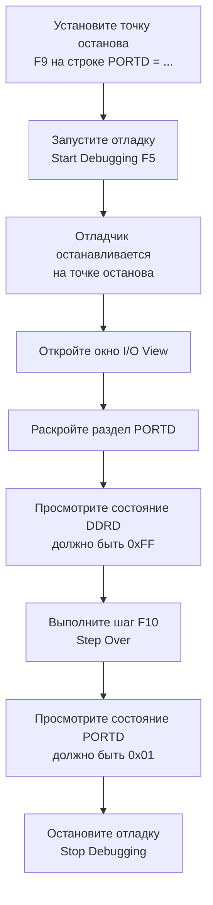

# Конспект лекции: Программирование микроконтроллеров. Введение

## Тема: Первая программа на C в Atmel Studio. Структура кода, управление GPIO и отладка.

### 1. Первые строки сгенерированного кода

#### 1.1. Директива `#include`
```c
#include <avr/io.h>
```
*   **Назначение:** Директива `#include` указывает **препроцессору** включить содержимое указанного файла в исходный код.
*   **Синтаксис:**
    *   `#include <имя_файла>` — для включения **системных** файлов из среды разработки (стандартных библиотек).
    *   `#include "имя_файла"` — для включения **пользовательских** файлов из проекта.

*   **Цепочка включения для ATmega8A:**
    1.  `#include <avr/io.h>` включает общий файл ввода-вывода.
    2.  В `io.h` на основе макроса `__AVR_ATmega8A__` выбирается конкретный файл для нашего МК: `#include <avr/iom8a.h>`.
    3.  Далее включается файл `#include <avr/portpins.h>`, который содержит удобные макроподстановки для работы с портами.

#### 1.2. Макросы в `portpins.h`
В файле `portpins.h` находятся определения вида:
```c
#define PORT7  7
#define PORT6  6
// ... и так далее
```
*   **Принцип работы:** Во время компиляции **препроцессор** находит в коде слово (например, `PORT4`) и автоматически заменяет его на соответствующее значение (в данном случае — цифру `4`).
*   **Цель:** Повышение читаемости и удобства написания кода.

#### 1.3. Директива `#define`
```c
#define <буквосочетание_1> <буквосочетание_2>
```
*   **Назначение:** Директива `#define` задает **макроподстановку**. Препроцессор заменяет все вхождения `<буквосочетание_1>` в коде на `<буквосочетание_2>`.
*   **Применение:** Используется для создания констант, коротких псевдонимов и условной компиляции.

### 2. Функция `main` — точка входа в программу

```c
int main(void)
{
    // ... тело функции ...
}
```

*   **Функция** — именованная подпрограмма, которую можно вызывать из других частей кода.
*   **Структура функции:**
    1.  **Возвращаемый тип:** Указывается перед именем (здесь — `int`, целое число). Обозначает значение, которое функция передает обратно в место вызова.
    2.  **Имя функции:** `main` — **главная и обязательная** функция. Выполнение программы начинается с нее.
    3.  **Входные аргументы (параметры):** Указываются в скобках `()` после имени. `void` означает, что функция **не принимает** аргументов.
    4.  **Тело функции:** Код, заключенный между фигурными скобками `{ }`, который будет выполняться при вызове функции.

### 3. Практическая часть: Подключение светодиода

Следуя традиции embedded-программирования, первая практическая задача — управление светодиодом (LED).

#### 3.1. Схема подключения светодиода к ATmega8A (порт D, ножка 0)



**Пояснение к схеме:**
1.  **Порт D0 (PD0) микроконтроллера** подключается через **ограничительный резистор** (номинал 220-470 Ом) к **аноду** (положительной ножке) светодиода.
2.  **Катод** (отрицательная ножка) светодиода подключается к **земле (GND)**.
3.  **Принцип работы:** Чтобы зажечь светодиод, на выходе порта D0 нужно установить **высокий логический уровень (1, HIGH, ~+5V)**, создав тем самым путь для тока от вывода МК через резистор и светодиод на землю. Чтобы погасить светодиод, на порту D0 нужно установить **низкий логический уровень (0, LOW, 0V)**.

### 4. Управление портами ввода-вывода (GPIO)

Порт D микроконтроллера ATmega8A состоит из 8 ножек (пинов), соответствующих 8 битам одного байта. Биты (и ножки) нумеруются с **0**.

#### 4.1. Настройка направления пинов (DDRx)

Чтобы управлять уровнем сигнала на пине (включать/выключать светодиод), пин必须先 быть сконфигурирован как **выход** (output).

```c
int main(void)
{
    DDRD = 0xFF;
```

*   **`DDRD`** — специальный регистр (переменная), определяющий **направление** пинов порта D (**D**ata **D**irection **R**egister).
    *   Бит = **1** → соответствующий пин настроен на **ВЫХОД** (микроконтроллер управляет уровнем).
    *   Бит = **0** → соответствующий пин настроен на **ВХОД** (микроконтроллер читает внешний уровень).
*   **`0xFF`** — значение в **шестнадцатеричном** формате.
    *   `0x` — префикс, указывающий на шестнадцатеричную систему.
    *   `FF` = 255<sub>10</sub> = **11111111<sub>2</sub>**.
    *   **Результат:** Все 8 бит регистра `DDRD` установлены в `1`. Все пины порта D (PD0-PD7) сконфигурированы как **выходы**.
*   **`;` (точка с запятой)** — обязательный разделитель операторов (команд) в языке C.
*   **`=` (оператор присваивания)** — присваивает значение, находящееся справа, переменной (регистру), находящейся слева.

#### 4.2. Установка уровня сигнала на пинах (PORTx)

После настройки пинов как выходов, можно управлять логическим уровнем на них.

```c
    DDRD = 0xFF;
    PORTD = 0b00000001;
```

*   **`PORTD`** — регистр, который управляет **выходным уровнем** на пинах порта D, сконфигурированных как выходы.
    *   Бит = **1** → на соответствующем пине устанавливается **высокий уровень** (логическая «1», обычно +5V).
    *   Бит = **0** → на соответствующем пине устанавливается **низкий уровень** (логический «0», 0V).
*   **`0b00000001`** — значение в **двоичном** формате.
    *   `0b` — префикс, указывающий на двоичную систему.
    *   Бит №0 (самый правый, младший) = `1` → **PD0 установлен в высокий уровень (1)**, светодиод горит.
    *   Остальные биты (1-7) = `0` → пины PD1-PD7 установлены в низкий уровень (0).

#### 4.3. Организация бесконечного рабочего цикла

Программа микроконтроллера должна работать непрерывно. Для этого используется бесконечный цикл.

```c
    PORTD = 0b00000001;
    while(1)
    {
        // Тело цикла
    }
}
```

*   **`while(условие)`** — конструкция **цикла с предусловием**.
    *   Перед каждым выполнением тела цикла проверяется **`условие`** в круглых скобках `()`.
    *   Если условие **истинно** (не равно нулю, в данном случае `1` = истина), выполняется код в **теле цикла** (между `{ }`).
    *   После выполнения тела проверка условия повторяется.
*   **`while(1)`** — классический приём для создания **бесконечного цикла**. Поскольку условие `1` всегда истинно, цикл никогда не завершится. Это гарантирует, что микроконтроллер будет постоянно выполнять код внутри цикла.



### 5. Отладка и симуляция в Atmel Studio

Отладка позволяет пошагово выполнять программу и наблюдать за состоянием регистров микроконтроллера.

#### 5.1. Процесс отладки по шагам



1.  **Установка точки останова:** Щелкните на серой полосе слева от строки с `PORTD = 0b00000001;` или нажмите **F9**. Появится красная точка.
2.  **Запуск отладки:** Нажмите кнопку **Start Debugging** (зелёный треугольник) или **F5**. Выполнение остановится на точке.
3.  **Открытие I/O View:** Нажмите кнопку **I/O View**. Найдите и раскройте узел **PORTD**.
4.  **Анализ состояния порта:** После остановки регистр `DDRD` должен иметь значение **0xFF** (все пины на выход).
5.  **Пошаговое выполнение:** Нажмите **Step Over (F10)**. Отладчик выполнит строку и перейдёт к следующей.
6.  **Наблюдение за изменением:** В `I/O View` значение регистра `PORTD` изменится на **0x01** (на PD0 установлена «1»). Это изменение также может отразиться в регистре `PIND`.

> **Примечание:** Регистр `PIND` предназначен для **чтения** текущего физического уровня на ножках порта. В симуляторе его состояние часто совпадает с `PORTD` для выходов.

#### 5.2. Практический пример для отладки

Для возможности пошагового выполнения добавьте тестовые строки:
```c
    DDRD = 0xFF;
    PORTD = 0b00000001; // Точка останова здесь
    PORTD = 0b00000010; // Шаг F10 сюда (зажгётся PD1, PD0 погаснет)
    while(1) { }
```
**После отладки не забудьте:**
1.  Остановить отладку (**Stop Debugging**).
2.  Удалить все точки останова (**Debug -> Delete All Breakpoints**).
3.  Удалить из кода добавленные для отладки тестовые строки.

---
### Вопросы для самопроверки

1.  Объясните разницу между регистрами `DDRD` и `PORTD`. Для чего нужен каждый из них?
2.  Рассчитайте и запишите в двоичном и шестнадцатеричном виде значение для регистра `DDRD`, если необходимо сконфигурировать пины PD0, PD3 и PD7 на выход, а остальные (PD1, PD2, PD4, PD5, PD6) — на вход.
3.  Почему в программе для микроконтроллера обязателен бесконечный цикл (например, `while(1)`)? Что произойдет, если его убрать?
4.  По приведенной в конспекте схеме подключения светодиода, какой уровень (HIGH/LOW) необходимо установить на пине PD0, чтобы светодиод зажегся? Объясните, почему.
5.  Для чего нужна точка останова (breakpoint) в процессе отладки? Как её установить и удалить в Atmel Studio?
6.  Какое окно в среде Atmel Studio позволяет в реальном времени отслеживать состояние регистров ввода-вывода во время симуляции?
7.  Что показывает регистр `PIND` и когда его чтение будет отличаться от значения в регистре `PORTD`?
8.  Какая клавиша или кнопка отвечает за команду **Step Over (F10)** и чем она отличается от **Step Into (F11)**?

### Глоссарий основных терминов

| Термин | Определение |
| :--- | :--- |
| **Препроцессор** | Этап компиляции, обрабатывающий директивы (`#include`, `#define`) перед переводом кода в машинные инструкции. |
| **Директива `#include`** | Команда препроцессору для включения содержимого указанного файла в текущий исходный код. |
| **Макрос (`#define`)** | Именованная текстовая подстановка. Препроцессор заменяет имя макроса на его определение во всём коде. |
| **Функция `main()`** | Главная функция программы на C/C++. Является обязательной точкой входа, с неё начинается выполнение. |
| **Регистр** | Специальная ячейка памяти в МК, непосредственно связанная с аппаратным модулем (порты, таймеры, АЦП и др.). |
| **`DDRx`** | **Data Direction Register**. Регистр направления данных порта. Определяет, работает ли пин как выход (1) или вход (0). |
| **`PORTx`** | **Data Register**. Регистр данных порта. Для выходов: устанавливает уровень (1/0). Для входов: включает/выключает подтяжку к питанию. |
| **`PINx`** | **Port Input Pins**. Регистр для чтения текущего логического уровня на физических выводах порта, независимо от настройки `DDRx`. |
| **Бесконечный цикл** | Цикл, условие выхода из которого никогда не становится ложным. Обеспечивает непрерывную работу программы МК. |
| **Точка останова (Breakpoint)** | Отладочная метка, установленная в строке кода. При достижении этой строки выполнение программы приостанавливается. |
| **Шаг с обходом (Step Over, F10)** | Команда отладчика: выполнить текущую строку кода, не заходя в вызываемые внутри неё функции (если они есть). |
| **I/O View** | Окно в отладчике Atmel Studio, отображающее состояние всех регистров ввода-вывода и периферии микроконтроллера. |
```
